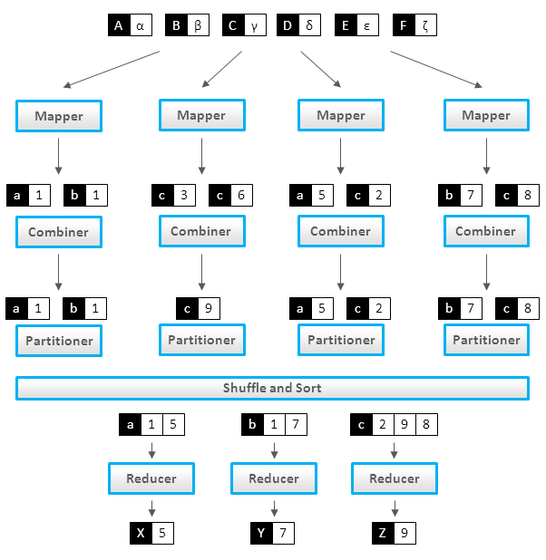

# CS 4480 Misc Notes

## MapReduce Patterns, algorithms, and use cases




### Basic MapReduce Patterns
最基础的是从那个统计词频的程序开始...    

```
class Mapper:
    method Map(docid id, doc d):
        for all term t in doc d do:
            emit(term i, count 1)
            
class Reducer:
    method Reduce(term t, counts [c1, c2, ...]):
        sum = 0
        for all count c in [c1, c2, ...] do:
            sum = sum + c
        emit(term t, count sum)
```

The obvious disadvantage of this approach is a high amount of dummy counters emitted by the Mapper. 


The Mapper can decrease a number of counters via summing counters for each document:

```
class Mapper:
    method Map(docid id, doc d):
        H = new AssociativeArray
        for all term t in doc d do:
            H{t} = H{t} + 1
        for all term t in H do:
            emit(term t, count H{t})
```

但是Mapper里做一次统计，还是不太好。 如果能对一个Mapper node处理过的所有doc都统计就更好了，很自然，用上了combiner：

```
class Mapper:
    method Map(docid id, doc d):
        for all term t in doc d do:
            emit(term t, count 1)
        
class Combiner:
    method Combine(term t, [c1, c2, ...]):
        sum = 0
        for all count c in [c1, c2, ...]:
            sum = sum + c
        emit(term t, count sum)
        
class Reducer:
    method Reduce(term t, counts [c1, c2, ...]):
        sum = 0
        for all count c in [c1, c2, ...] do :
            sum = sum + c
        emit(term t, count sum)
```

稍微进阶一点的MapReduce Pattern

PageRank and Mapper-Side Data Aggregation   

```
class N
    State PageRank
    
method getMessage(object N):
    return N.State / N.OutgoingRelations.size()
    
method calculateState(state s, data [d1, d2, ...]):
    return (sum([d1, d2, ...]))
    
class Mapper:
    method Initialize:
        H = new AssociativeArray
    method Map(id n, object N):
        p = N.PageRank / N.OutgoingRelations.size()
        emit(id n, object N)
        for all id m in N.OutgoingRelations do:
            H{m} = H{m} + p
    method Close:
        for all id n in H do:
            emit(id n, value H{n})
            
class Reducer:
    method Reduce(id m, [s1, s2, ...]);
        M = null
        p = 0
        for all s in [s1, s2, ...] do :
            if IsObject(s) then:
                M = s
            else:
                p = p + s
        M.PageRank = p
        emit(id m, item M)
 ```


Cross-Correlation   
建TF-IDF等各种co-occurance matrix的时候用到：   

1. Pairs Approach
    emit所有的pair，和dummy counter
    * 但是combiner效果有限
    * 没有in-memory accumulation

```
 class Mapper:
    method Map(null, items [i1, i2, ...]):
        for all item i in [i1, i2, ...]:
            for all item j in [i1, i2, ...]:
                emit(pair [i, j], count 1)
    
class Reducer:
    method Reduce(pair [i, j], counts [c1, c2, ...]):
        s = sum([c1, c2, ...])
        emit(pari [i, j], count s)
```
 
 2. Stripes Approach
    * 根据第一个item group起来，维护一个associative array。
    * 这样能累积统计总数

```
class Mapper:
    method Map(null, items [i1, i2, ...]):
        for all item i in [i1, i2, ...]:
            H = new AssociativeArray : item -> counter
            for all item j in [i1, i2, ...]:
                H{j} = H{j} + 1
            emit(item i, strip H)
            
class Reducer:
    method Reduce(item i, stripes [H1, H2, ...]):
        H = new AssociativeArray : item -> counter
        H = merge-sum ([H1, H2, ...])
        for all item j in H.keys():
            emit(pair [i, j], H{j})
```

### Relational MapReduce Patterns

#### Selection

```
class Mapper:
    method Map(rowkey key, tuple t):
        if t satisfies the predicate:
            emit(tuple t, null)
```

#### Project
Reducer用来去重(drop duplicate)

```
class Mapper:
    method Map(rowkey key, tuple t):
        tuple g = project(t) # extract required fields to tuple g
        emit(tuple g, null)
        
class Reducer:
    method Reduce(tuple t, array n):  # n would be an array of nulls
        emit(tuple t, null)
```

#### Union
Reducer去重

```
class Mapper:
    method Map(rowkey key, tuple t):
        emit(tuple t, null)
    
class Reducer:
    method Reduce(tuple t, array n):  # n is an array of one or two nulls
        emit(tuple t, null)
```

#### Intersection

```
class Mapper:
    method Map(rowkey key, tuple t):
        emit(tuple t, null)
        
class Reducer:
    method Reduce(tuple t, array n):  # n is an array of one or two nulls
        if n.size() == 2:
            emit(tuple t, null)
```

#### Difference
假设有俩set， 一个R， 一个S，求R-S

```
class Mapper
    method Map(rowkey key, tuple t):
        emit(tuple t, string t.SetName)  # t.SetName is either 'R' or 'S'
        
class Reducer:
    method Reduce(tuple t, array n):  # array n can be ['R'], ['S'], ['R', 'S'] or ['S', 'R']
        if n.size() == 1and n[0] = 'R':
            emit(tuple t, null)
```

#### GroupBy and Aggregation
Mapper 抽出用来Group 和Aggregate的值， Reducer做计算

```
class Mapper:
    method Map(null, tuple [value GroupBy, value AggregateBy, value ...]):
        emit(value GroupBy, value AggregateBy)

class Reducer:
    method Reducer(value GroupBy, [v1, v2, ...]):
        emit(value GroupBy, aggregate ([v1, v2, ...])  # aggreate(): sum(), max(), ...
```


#### Joining
这个最难... cao   

##### Repartition Join(Reduce Join, Sort-Merge Join)
设通过key k来join两个R和L set。  
Mapper遍历R和L的所有tuple， 抽出key k的tuple来，打上‘R'/’L‘的tag，emit含有tag的tuple， key k作为key。   
Reducer收到所有k的tuple， 分成两个bucket - R和L。 用nested loop 来emit一个cross join。 

**缺点**：
    - Mapper把所有data都emit了，即使不成pair的。
    - Reducer要加载一个key的所有data到memory里， memory不够大的话有各种问题。

```
class Mapper:
    method Map(null, tuple [join_key k, value v1, value v2, ...]):
        emit(join_key, tagged_tuple [set_name, values [v1, v2, ...])
        
class Reducer:
    method Reduce(join_key k, tagged_tuples [t1, t2, ...]):
        H = new AssociativeArray : set_name -> values
        for all tagged_tuple t in [t1, t2, ...]:  # separate values into 2 arrays
            H{t.tag}.add(t.values)
        for all values r in H{'R'}:  # produce a cross-join of the array
            for all values l in H{'L'}:
                emit(null, [k, r, l])
```

##### Replicated Join (Map Join, Hash Join)
如果是一个小set（能加载到每个Mapper的内存里）来join一个大的...   
还是说我们有一个R， 一个L， R是那个小的。

```
class Mapper:
    method Initialize:
        H = new associativeArray: join_key -> tuple from R
        R = loadR()
        for all [join_key k, tuple [r1, r2, ...]] in R:
            H{k} = H{k}.append([r1, r2, ...])
            
    method Map(join_key k, tuple l):
        for all tuple r in H{k}:
            emit(null, tuple [k, r, l])
```


## Apache Pig syntax

```
A = LOAD 'a.txt' AS (col11:chararray, col2:double, col3:int);
B = FOREACH A GENERATE col1, ... ;
DUMP B;
C = B FILTER BY expression;
D = C GROUP BY col1;

X = JOIN A BY a1, B BY b1;


E = JOIN A BY $0 LEFT OUTER, B BY $0;
F = JOIN A BY $0 FULL, B BY $0;

G = ORDER A by $0, DESC, f2 ASC;
```

